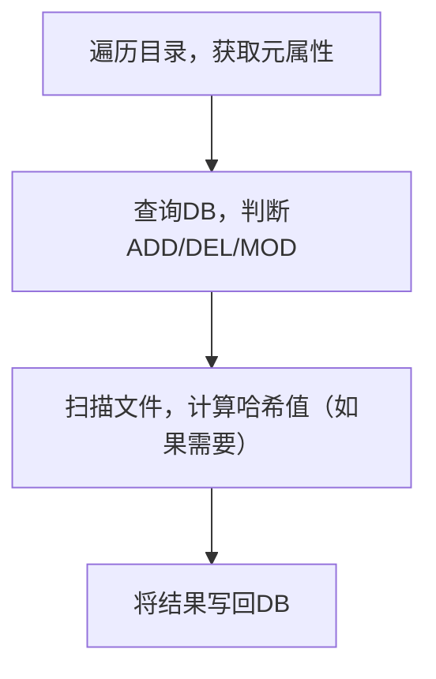

# 文件索引器

## 背景

我们的文件常常分散在各个地方，如本地、U 盘、Nas、云盘等，我们需要一个工具来帮助我们快速找到我们需要的文件。

## Features

- [x] 支持通过哈希值索引文件
- [x] 自动跳过已索引的文件
- [ ] 支持不同数据库的合并
- [ ] webui

## 使用

```shell
sudo docker run --rm -v $(pwd):$(pwd) registry.cn-shenzhen.aliyuncs.com/suyiiyii/py:5 $(pwd) --db_path $(pwd)/indexer.db --log_path $(pwd)/indexer.log
```

## 扫描步骤



## TODO

添加文件夹表
网页搜索面板
两边数据库文件匹配重复文件
