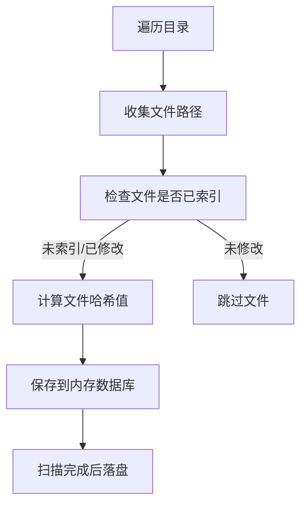

# pyFileIndexer - 文件索引与去重工具

## 项目简介

pyFileIndexer 是一个高效的文件索引和去重工具，通过计算文件哈希值（MD5、SHA1、SHA256）建立文件指纹数据库，帮助您管理分散在不同存储设备（本地、U盘、NAS、云盘）上的文件，快速查找重复文件并追踪文件分布。

## 核心功能

- ✅ **文件指纹建档**：为每个文件计算三种哈希值，建立唯一标识
- ✅ **智能增量扫描**：自动跳过未修改的已索引文件，提升扫描效率
- ✅ **多设备文件追踪**：记录文件在不同设备的分布情况
- ✅ **重复文件检测**：通过哈希值快速识别内容相同的文件
- ✅ **灵活的忽略规则**：通过 `.ignore` 文件配置需要跳过的目录

## 快速开始

### 使用 Docker（推荐）

```bash
# 扫描当前目录
docker run --rm -v $(pwd):$(pwd) \
  ghcr.io/suyiiyii/pyfileindexer:main \
  scan $(pwd) \
  --machine-name "MyDevice" \
  --db-path $(pwd)/indexer.db \
  --log-path $(pwd)/indexer.log
```

#### 在 Docker 中启用 Metrics 端点

- 固定端口（推荐）：明确设置容器监听端口并做端口映射

```bash
# 在容器内监听 9090，并映射到宿主机 9090
docker run --rm \
  -p 9090:9090 \
  -v $(pwd):$(pwd) \
  ghcr.io/suyiiyii/pyfileindexer:main \
  scan $(pwd) \
  --machine-name "MyDevice" \
  --db-path $(pwd)/indexer.db \
  --log-path $(pwd)/indexer.log \
  --metrics-host 0.0.0.0 \
  --metrics-port 9090

# 访问指标
curl http://127.0.0.1:9090/metrics
```

- 自动选择端口（容器内从 9000 开始递增）
  - 方式一：映射端口范围（例如 9000–9100），容器选中的端口将被暴露到宿主机
  - 方式二：使用 host 网络（容器与宿主机共享网络命名空间）

```bash
# 方式一：映射端口范围
docker run --rm \
  -p 9000-9100:9000-9100 \
  -v $(pwd):$(pwd) \
  ghcr.io/suyiiyii/pyfileindexer:main \
  scan $(pwd) \
  --machine-name "MyDevice" \
  --db-path $(pwd)/indexer.db \
  --log-path $(pwd)/indexer.log \
  --metrics-host 0.0.0.0 \
  --metrics-port 0

# 查看容器日志，确认实际绑定端口（示例：Metrics listening on 0.0.0.0:9003）

# 方式二：使用宿主网络（不适用于所有环境）
docker run --rm \
  --network host \
  -v $(pwd):$(pwd) \
  ghcr.io/suyiiyii/pyfileindexer:main \
  scan $(pwd) \
  --machine-name "MyDevice" \
  --db-path $(pwd)/indexer.db \
  --log-path $(pwd)/indexer.log \
  --metrics-host 127.0.0.1 \
  --metrics-port 0

### 本地运行

```bash
# 安装依赖（使用 uv 包管理器）
uv sync

# 扫描指定目录
uv run python pyFileIndexer/main.py scan /path/to/scan \
  --machine-name "MyLaptop" \
  --db-path ./files.db \
  --log-path ./scan.log
```

### 命令说明

pyFileIndexer 使用子命令方式运行，支持三种模式：

#### 1. 扫描模式 (scan)

扫描指定目录，建立文件索引：

```bash
uv run python pyFileIndexer/main.py scan <path> [选项]
```

**参数：**
- `path`: 要扫描的目录路径（必需）
- `--machine-name`: 设备标识名称，用于区分不同存储位置
- `--db-path`: 数据库文件保存路径（默认：indexer.db）
- `--log-path`: 日志文件保存路径（默认：indexer.log）

#### 2. Web 服务模式 (serve)

启动 Web 界面，浏览和搜索已索引的文件：

```bash
uv run python pyFileIndexer/main.py serve [选项]
```

**参数：**
- `--db-path`: 数据库文件路径（默认：indexer.db）
- `--port`: Web 服务器端口（默认：8000）
- `--host`: Web 服务器地址（默认：0.0.0.0）
- `--log-path`: 日志文件保存路径（默认：indexer.log）

#### 3. 合并模式 (merge)

合并多个数据库文件：

```bash
uv run python pyFileIndexer/main.py merge --source db1.db db2.db db3.db --output merged.db
```

**参数：**
- `--source`: 源数据库文件列表（必需，支持多个）
- `--output`: 输出合并后的数据库路径（默认：merged.db）
- `--log-path`: 日志文件保存路径（默认：indexer.log）


**Web 模式专用参数：**
- `--port`: Web 服务器端口（默认：8000）
- `--host`: Web 服务器主机地址（默认：0.0.0.0）

## 使用场景

### 1. 查找重复文件
扫描多个目录后，使用 SQL 查询重复文件：
```sql
SELECT h.md5, h.size, GROUP_CONCAT(m.path, '
') as paths
FROM file_hash h
JOIN file_meta m ON h.id = m.hash_id
GROUP BY h.md5
HAVING COUNT(*) > 1;
```

### 2. 多设备文件管理
扫描不同设备并汇总到一个数据库：
```bash
# 在不同设备上分别扫描
uv run python pyFileIndexer/main.py scan /Volumes/USB1 --machine-name "USB1" --db-path usb1.db
uv run python pyFileIndexer/main.py scan /nas/data --machine-name "NAS" --db-path nas.db
uv run python pyFileIndexer/main.py scan /backup --machine-name "BackupDisk" --db-path backup.db

# 合并所有数据库
uv run python pyFileIndexer/main.py merge \
  --source usb1.db nas.db backup.db \
  --output all_devices.db

# 使用合并后的数据库查找跨设备的重复文件
uv run python pyFileIndexer/main.py serve --db-path all_devices.db
```

### 3. 定期备份扫描
创建定时任务，定期更新文件索引：
```bash
# crontab -e
0 2 * * 0 docker run -v /backup:/backup pyfileindexer scan /backup --machine-name "BackupDisk" --db-path /backup/index.db
```

## 数据库结构

项目采用双表分离设计，优化存储和查询性能：

- **file_hash 表**：存储文件哈希值和大小（去重存储）
- **file_meta 表**：存储文件元数据（路径、名称、时间戳、设备名等）

这种设计确保相同内容的文件共享哈希记录，大幅减少存储空间。

## 工作原理



## 配置忽略规则

默认不启用任何跳过逻辑。若需要启用忽略规则，在工作目录创建 `settings.toml` 并开启：

```
ENABLE_IGNORE_RULES = true
```

随后在项目根目录创建 `.ignore` 文件，支持按目录名或路径子串配置：

```
# 目录名精确匹配
node_modules
.git
__pycache__

# 路径包含匹配
/temp/
/cache/
```

## 注意事项

1. **数据覆盖**：当前版本每次扫描会覆盖之前的数据库（后续版本将支持增量更新）
2. **内存使用**：扫描过程使用内存数据库，大规模扫描时请注意内存占用
3. **中断处理**：支持 Ctrl+C 安全中断，数据会在中断时落盘保存

## Web UI 界面

项目提供了基于 React 的 Web 界面，支持文件搜索、统计查看和重复文件检测。

### 启动 Web 界面

```bash
# 确保已扫描文件并生成数据库
uv run python pyFileIndexer/main.py scan /path/to/scan --db-path files.db

# 启动 Web 服务器
uv run python pyFileIndexer/main.py serve --db-path files.db --port 8000
```

### 前端构建

如果前端未构建，需要手动构建：

```bash
cd frontend
pnpm install
pnpm run build
```

## TODO

- [x] 支持多数据库合并
- [x] Web UI 界面
- [x] 增量更新模式
- [x] 压缩包文件扫描（ZIP、TAR、RAR）
- [ ] 文件夹级别索引
- [ ] 导出报告功能

## License

MIT
