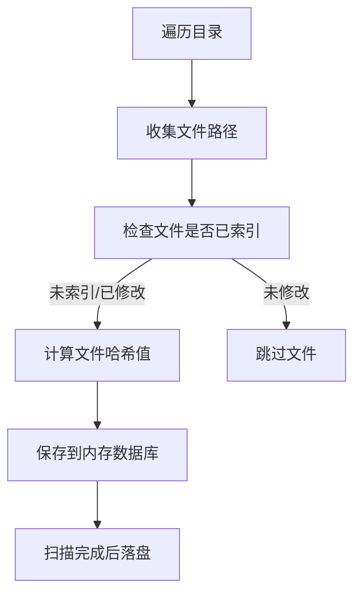

# pyFileIndexer - 文件索引与去重工具

## 项目简介

pyFileIndexer 是一个高效的文件索引和去重工具，通过计算文件哈希值（MD5、SHA1、SHA256）建立文件指纹数据库，帮助您管理分散在不同存储设备（本地、U盘、NAS、云盘）上的文件，快速查找重复文件并追踪文件分布。

## 核心功能

- ✅ **文件指纹建档**：为每个文件计算三种哈希值，建立唯一标识
- ✅ **智能增量扫描**：自动跳过未修改的已索引文件，提升扫描效率
- ✅ **多设备文件追踪**：记录文件在不同设备的分布情况
- ✅ **重复文件检测**：通过哈希值快速识别内容相同的文件
- ✅ **灵活的忽略规则**：通过 `.ignore` 文件配置需要跳过的目录

## 快速开始

### 使用 Docker（推荐）

```bash
# 扫描当前目录
docker run --rm -v $(pwd):$(pwd) \
  registry.cn-shenzhen.aliyuncs.com/suyiiyii/py:5 \
  $(pwd) \
  --machine_name "MyDevice" \
  --db_path $(pwd)/indexer.db \
  --log_path $(pwd)/indexer.log
```

### 本地运行

```bash
# 安装依赖（使用 uv 包管理器）
uv sync

# 扫描指定目录
uv run python pyFileIndexer/main.py /path/to/scan \
  --machine_name "MyLaptop" \
  --db_path ./files.db \
  --log_path ./scan.log
```

### 参数说明

- `path`: 要扫描的目录路径（必需）
- `--machine_name`: 设备标识名称，用于区分不同存储位置
- `--db_path`: 数据库文件保存路径（默认：indexer.db）
- `--log_path`: 日志文件保存路径（默认：indexer.log）

## 使用场景

### 1. 查找重复文件
扫描多个目录后，使用 SQL 查询重复文件：
```sql
SELECT h.md5, h.size, GROUP_CONCAT(m.path, '
') as paths
FROM file_hash h
JOIN file_meta m ON h.id = m.hash_id
GROUP BY h.md5
HAVING COUNT(*) > 1;
```

### 2. 多设备文件管理
扫描不同设备并汇总：
```bash
# 扫描 U 盘
uv run python pyFileIndexer/main.py /Volumes/USB1 --machine_name "USB1" --db_path all_files.db

# 扫描 NAS（追加到同一数据库）
uv run python pyFileIndexer/main.py /nas/data --machine_name "NAS" --db_path all_files.db
```

### 3. 定期备份扫描
创建定时任务，定期更新文件索引：
```bash
# crontab -e
0 2 * * 0 docker run -v /backup:/backup pyfileindexer /backup --machine_name "BackupDisk" --db_path /backup/index.db
```

## 数据库结构

项目采用双表分离设计，优化存储和查询性能：

- **file_hash 表**：存储文件哈希值和大小（去重存储）
- **file_meta 表**：存储文件元数据（路径、名称、时间戳、设备名等）

这种设计确保相同内容的文件共享哈希记录，大幅减少存储空间。

## 工作原理



## 配置忽略规则

在项目根目录创建 `.ignore` 文件，配置需要跳过的目录：

```bash
# 不包含 / 的行：精确匹配目录名
node_modules
.git
__pycache__

# 包含 / 的行：匹配路径中包含该字符串的目录
/temp/
/cache/
```

## 注意事项

1. **数据覆盖**：当前版本每次扫描会覆盖之前的数据库（后续版本将支持增量更新）
2. **内存使用**：扫描过程使用内存数据库，大规模扫描时请注意内存占用
3. **中断处理**：支持 Ctrl+C 安全中断，数据会在中断时落盘保存

## TODO

- [ ] 支持多数据库合并
- [ ] Web UI 界面
- [ ] 增量更新模式
- [ ] 文件夹级别索引
- [ ] 导出报告功能

## License

MIT
